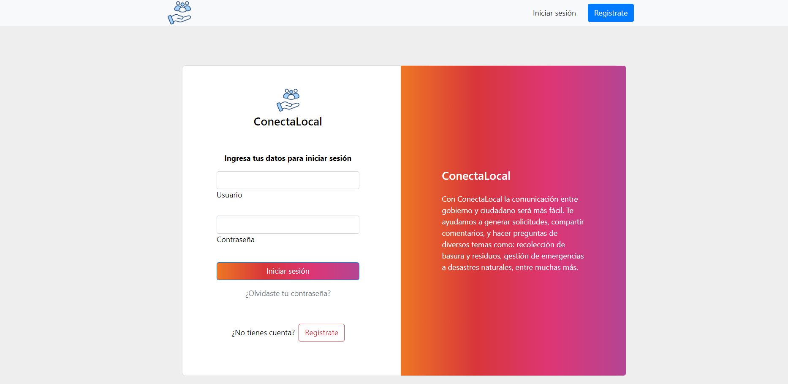
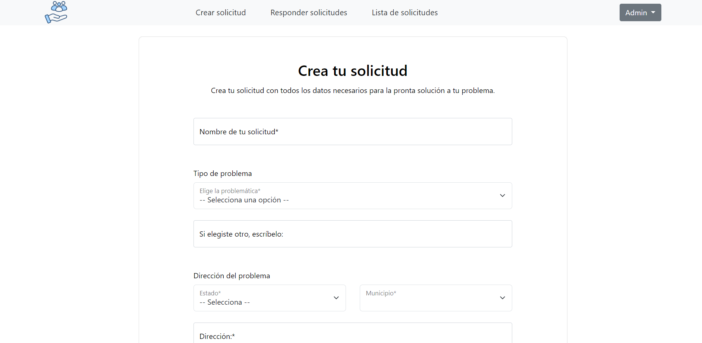
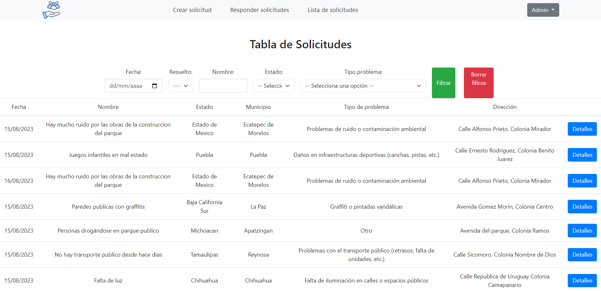

# ContectaLocal - Government Request Management 🏛️

## What is ContectaLocal? 🤔

ContectaLocal is an application that helps government organizations efficiently manage and respond to citizen requests.

## Main Features 💡

- ✅ Generate requests
- 💌 Respond to requests
- 📊 Generate request reports
- 🔒 User role-based security
- 📦 Uses **PostgreSQL** as a database
- 🔑 User login system
- 📈 System to generate Excel reports of created requests

## Technologies Used 🌐

ContectaLocal has been created using the following technologies:

- ⚙️ Backend developed in **Python** with the **Django** framework
- 💻 Frontend with **JavaScript** and **Bootstrap**
- 📡 Implementation of a documented **REST API**
- 🔐 Security with user login and registration
- 🌐 Integration with external services to retrieve relevant information

## Open311 Standard 🌐

ContectaLocal is based on the [**Open311**](https://www.open311.org/) standard for government request management.

## Screenshots 📸

Below are some screenshots of ContectaLocal:

### Login Screen

### Main Menu

### Request Creation Form

### Request List

---

# ContectaLocal - Gestión de Solicitudes Gubernamentales 🏛️

## ¿Qué es ContectaLocal? 🤔

ContectaLocal es una aplicación que ayuda a las organizaciones gubernamentales a gestionar y responder eficientemente las solicitudes de la ciudadanía.

## Características principales 💡

- ✅ Genera solicitudes
- 💌 Responde a las solicitudes
- 📊 Genera informes de solicitudes
- 🔒 Módulo de seguridad con roles de usuario
- 📦 Utiliza **PostgreSQL** como base de datos
- 🔑 Sistema de inicio de sesión de usuarios
- 📈 Sistema para generar reportes en Excel de las solicitudes creadas

## Tecnologías utilizadas 🌐

ContectaLocal ha sido creada utilizando las siguientes tecnologías:

- ⚙️ Backend desarrollado en **Python** con el framework **Django**
- 💻 Frontend con **JavaScript** y **Bootstrap**
- 📡 Implementación de una **API REST** documentada
- 🔐 Seguridad con manejo de inicio de sesión y registro
- 🌐 Integración con servicios externos para consultar información relevante

## Estándar Open311 🌐

ContectaLocal se basa en el estándar [**Open311**](https://www.open311.org/) para la gestión de solicitudes gubernamentales.

## Capturas de Pantalla 📸

A continuación, se muestran algunas capturas de pantalla de ContectaLocal:

### Pantalla de Inicio de Sesión

### Menú Principal

### Formulario para Crear Solicitud

### Lista de Solicitudes

